# Spring 2018
# Project 1:  Spooky Textual Analysis

## Project Description
This is the first and only *individual* (as opposed to *team*) this semester. 

Term: Spring 2018

+ Project title: Understanding gender and character actions in the 19th century horror novels 
+ This project is conducted by Wanting Cheng, Columbia(UNI: wc2628)

+ Project summary: In this project, I explore the relationship between character gender and character actions in the context of horror stories written in the 19th century by three authors. I study the ratio of male vs. female in each author, the popular action words associated with male and female characters, and use clustering methods to analyze the difference in the portrayal of gender roles.

## 1. Introduction and Data

  I've always been interested in whether authors portray their male and female characters differently, and have taken classes where the professor discussed how gender roles are largely different in the 19th century. This project provides me with a great opportunity to approach this question from a more quantitative perspective. In particular, I'm also curius about whether the gender of the author make a difference on how s/he depict gender roles, since we have two male authors (EAP, HPL) and one female author (MWS). 
  
  This project seeks to answer the following questions:
  
  + How does the occurence of pronouns look? Does the female author talk more about female characters?
  
  + Which verbs or words are most associated with male and female characters? What do male and female characters do in novels written by each author?
  
  + Is there a way to guess the gender of the character given a word, a token, a sentence?
  
  Regarding Spooky data, we are given 19579 sentences in total, each written by one of the authors Edgar Allan Poe (EAP), HP Lovecraft (HPL), and Mary Shelley (MWS). In the data file, EAP has 7900 sentences, HPL has 5635 sentences, and MWS has 6044. For this study I defined two classes of pronouns: the male pronouns were "he" and the female pronouns were "she". I then used tidy data principles and n-grams to get the word following the pronouns, and treated them as the character actions.

## 2. Pronoun Occurence
  As I considered this topic, the first questions that came to my mind is: Are female authors more likely to mention female characters in their novels? What are the ratio of pronoun occurence of each authors?
  
  Here I plot the pronoun occurence of all authors:
  
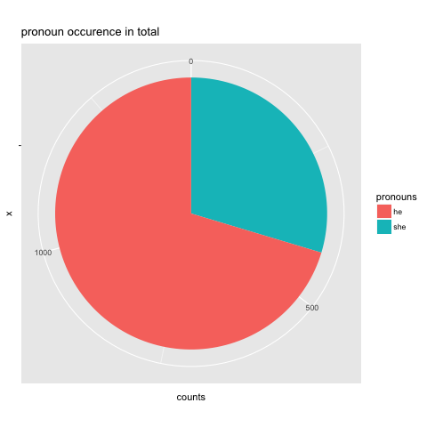

  From the pie chart, it is obvious that the red occupies almost 3/4 of the pie, representing the number of times in total that "he" comes up in the corpus. 
  
  *Note: I removed bigrams of "he he" because it seems that EAP likes to mimic character laughing as "he he he". In this context, "he" shouldn't be considered as a pronoun.*
  
  I find:
  + The inbalance in occurence of male and female pronouns. It seems that aggregately male characters are more often brought up in the horror stories written by the three authors.
  + Note that I've only included "he" or "she" in the pronoun list due to time limit. If I included "him", "his", "man", "her", and "women", maybe things will be different. 
  
  I am also interested in the difference across authors, so I plot the occurence of pronouns for each author:

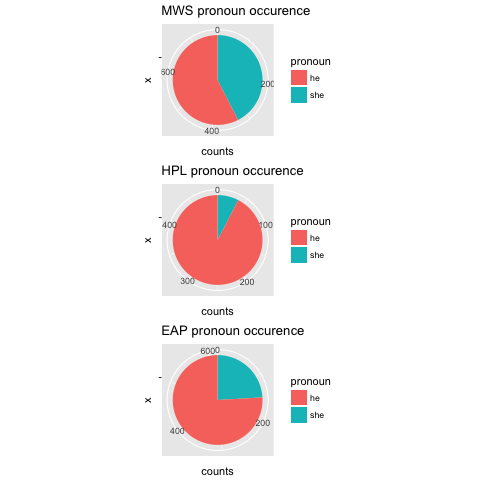

  
  I find:
  + MWS, as a female write, has the most balanced usage the pronouns. However, the appearance of "he" is still more frequent than that of "she".
  + HPL seems to favor male characters much more than female characters, as he writes "she" for only 38 times and "he" for 461 times.
  + Still, had I included more gender pronouns or indicators, the results might have more detailed implications.

## 3. Gender actions
  To analyze what male and female characters typically do and don't do, I take a closer look at the action verb or modifiers associated with the pronouns. Some papers used dependency parsing, but for the time sake I simply used bigrams to achieve the similar effect. The second word of the bigrams that start with "he" or "she" are mostly verbs, the main thing I'm interested in. After getting a list of the words following "he" or "she" as well as the number of times it appears, I used a simple function to represent the relative usage for "she" and "he".
  
  'log ratio = log2(# of times used after "she" \ # of times used after "he")'
  
  Therefore, the larger the log ratio, the stronger "relationship" between the word and "she", or the more indicative the word is describing a female character. On the other hand, the smaller the log ratio, the more possibility that there is a significant relationship between the word and male character. 
  
  First I arranged the words that have log ratios closest to 0 - these are the words that are perceived as "gender neutral".
  
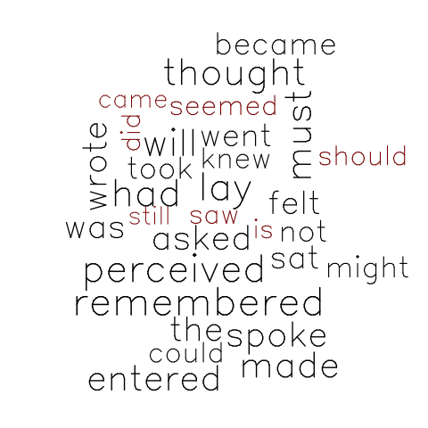

  Next, I ranked the words that have largest absolute value of their log ratios - these are the words that are perceived as associated with male or female characters, disregarding which author wrote such words.
  
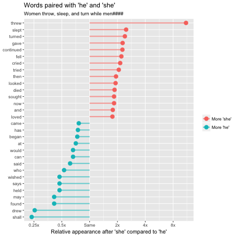

  The words marked with red lines are the ones with highest log ratios, meaning that although it frequently appears after both pronouns, the comparative usage of such words after "she" is much more frequent than after "he". The ticks on the x-axis represent how many times the word is used after "she" than "he". "0.25x" means that the word follows "he" 4 times more than it follows "she".

  I find:
  
  + These words are the most different in how the three authors used them with the pronouns “he” and “she”. Women in horror novels in the 19th century do things like throw, sleep, turn, give, continue, fall, cry, and try. In contrast, men in these novels do things like draw, find, hold, say, wish, and begin.
  
  + There are a lot of words in the male category, like "may", "shall", "can", that doesn't relate to specific action. It's reasonable to guess that male characters are more frequently portrayed from a **first person** perspective. If time permits, I should have included the word following such auxiliary verbs, to have a better idea of what men tend to do.
  
  + Whereas female tends to have past tense in their action words, male have more present tense words such as "may" and "can".
  
  Since I am also interested in how the three authors depict their characters differently in the perspective of gender, I applied the same method on the three authors separately and graphed the results.
  
  
+ EAP action words
  
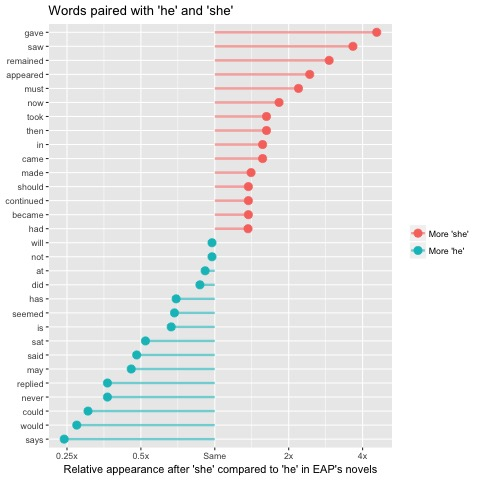
  
  
+ HPL action words
  
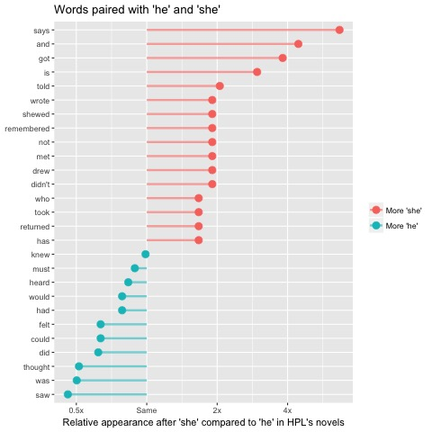
  
  
+ MWS action words
  
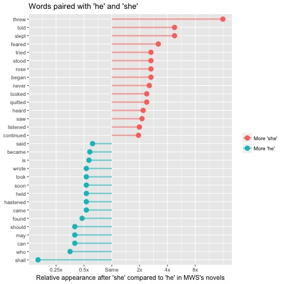
  
  
  I find:
  
  + The upper part of the graph of HPL had many words with the same log ratio. This is probably due to the fact that HPL have so few usage of female pronoun and the words following "she" have the same frequency.
  
  + The distribution of these verbs appeared to support existing scholarship on 19th century gender stereotypes; many of the verbs indicating a female pronoun are associated with emotion while many of the verbs indicating a male pronoun are associated with physical action and motion.
  
  + Female characters in MWS's stories seem to like thowing things a lot, as "threw" appears after "she" 8 times more often than "he".
  

## 4. Experiments Using Gene Classifier

  The analysis in part 3 used a rather simple functon to represent the relative use of words, that might distinguish between the characters of male and female. But I wonder if there are more subtle ways to distinguish between these verbs. Enlighed by this paper [Understanding Gender and Character Agency in the 19th Century Novel](http://culturalanalytics.org/2016/12/understanding-gender-and-character-agency-in-the-19th-century-novel/), I ran a series of classification esperiments using the **nearest shrunken centroids classifier** (NSC). I chose this classifier because, as Jockers and Kirilloff	mention in their research, The NSC classifier has the advantage of being a highly interpretable classifier. 
  
>  It not only returns class predictions and the probabilities associated with those predictions, but it performs feature selection and provides statistical data about which features were found to be most useful in the overall classification and which classes those features are most or least associated with.
  
  Eventually, I want to reach the goal of distinguishing between verbs that showed little value in separating the two gender and verbs that showed a strong association with one class or the other.
  
### 4.1 What is Nearest Shrunken Centroids Classifier?

  NSC classifier is originally a tool to diagnose multiple cancer types by examining their gene expression. Suppose we are given a sample of cancer cells as well as their numerical gene expression, the NSC classifier can identify a subset of genes that best characterizes each cancer type. More specifically, each class (or cancer type in this case) will have a class centroid with the subset of genes in it. Furthermore, the classifier has a choice to shrink the centroids, by which it gives higher weight to genes whose expression is stable within samples of the same class. The amount of shrinkage is called "threshold value". The larger the threshold value, the more genes are eliminated from the centroid.
  
  Similar to the application of NSC classifier on cancer cells, I applied the NSC classifier on our corpus. In our case, gender class acts like cancer types, the extracted words that follow the pronouns act like genes, the number of times the words appeared in our corpus act like the numerical gene expressions. The sample cells corresponds to a combination of a gender and an author. For example, (MWS, female) will be a sample in our case, words like "throw" and "tell" will be genes, and the frequency that such words appear will be the gene expressions. The classifier thus can differentiate gender class by building a shrunken centroid for each gender using the word frequency.
  
  Here I provide a snapshot of the dataset to have a better idea of the input to the model:

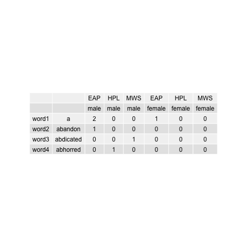

  This is a dataframe with 8 columns and 1136 rows, with 1134 words serving as classification features of gender class. As I explained before, each column will serve as a sample.
  
### 4.2 Classification Experiments

  I began with a cross validation experiment. This process is to find the training errors for different values of the shrinkage parameter, or threshold value. The goal of this experiment is to have an idea of what threshold value will give us the most satisfying effect. The graph below shows the results, from no shrinkage (Left) to complete shrinkage (Right). Both the cross-validated and test error were minimized near 1.8, which is the value we used as threshold. The upper axis shows the number of active words. At 1.8, there are about 47 active words.

  

  Having selected the threshold value = 1.8, I can then use the function `pamr.plotcvprob` to construct estimates of the class probabilities, as shown in the graph below. The graph displays the calculated probabilities for the training data to be inside either class. 
  
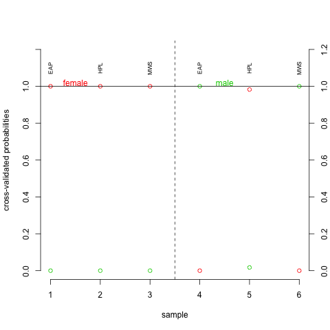

  I find:
  
  + I have a total of 6 samples and all samples have good separation between the highest and lower probability, demonstrating that the sample is unambiguously classified by the method.
  
  + The male samples have lower probability compared to female samples, meaning that the feature of male samples is more ambiguous.
  
  
  My next step is to screen out the words that the machine found most useful in differentiating between male and female pronouns. The rows are ranked from 1 to 24 based on how useful they were to the model.  The horizontal axis represent their log expression ratio with respect to the gender. The larger the ratio, the stronger connection between the word and the pronoun.
  
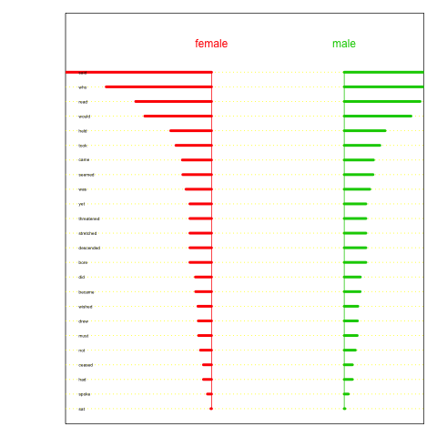

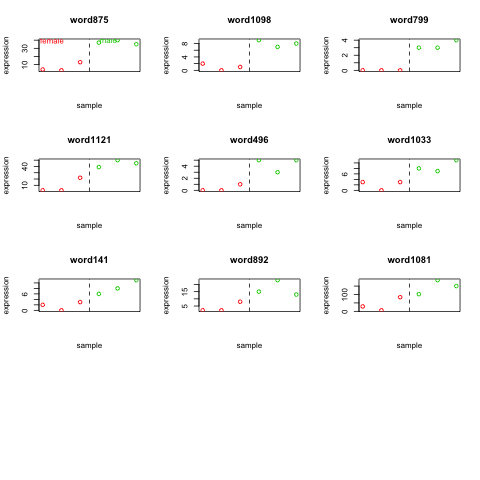

  The previous graph is carried out through the function `pamr.plotcen` and needs prettying. A little visualization of the previous graph is attached below. Words with larger fonts are the ones most useful in differentiating between male and female pronouns.
  
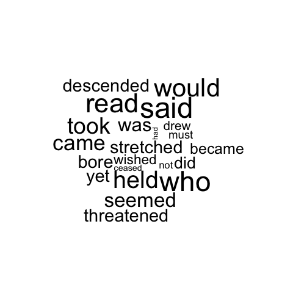

  I find:
  
  + Comparing the word cloud to the graph in section 3, I noticed that many words appear in both graphs, eg. "who", "said", "wished", "drew", "came". This demonstrates that the result given by NSC classifier is somewhat similar to the EDA we did before. 
  
  + In section 3 these words are all paired more frequently with "he".
  
### 4.3 How can the NSC classifier help us identify genders?

  Since our objective was not ultimately to predict likely pronoun genders from a set of verbs, but rather to understand the types of agency associated with male and female characters in the 19th-century horror novel, NSC was an effective model to deploy since it would distinguish between which verbs showed little value in separating the two gender classes and which verbs showed a strong association with one class or the other. 
  
  However, NSC could also be used to predict gender of a test set. Nearest centroid classification takes the action words of a new sample, and compares it to both of these gender centroids. The class whose centroid that it is closest to, in squared distance, is the predicted class for that new sample. If I had more time and more data, I could perform some prediction using NSC and see if it is in fact effective in predicting character gender.
  

## 5. Conclusion

  By the measures employed in this simple blog, I learned that there is a strong correlation between character gender and verbs in the 19th century horror novel. To answer the questions that I listed before performing the research, I have found that:
  
  + MWS, the only female author among the three, talks much more frequently about female characters than the other two authors.
  
  + It seems that female tends to have past tense in their action words, whereas male have more present tense words such as "may" and "can". What's more, male characters are more frequently portrayed from a **first person** perspective.
  
  + The distribution of these verbs appeared to support existing scholarship on 19th century gender stereotypes; many of the verbs indicating a female pronoun are associated with emotion while many of the verbs indicating a male pronoun are associated with physical action and motion.
  
  + Applying cancer classification method on our corpus, I developed a way to differentiate between male sample and female sample, and a potential way to predict the gender of a given text.
  

## Reference

 + [Treemap House of Horror - Spooky EDA/LDA/Features](https://www.kaggle.com/headsortails/treemap-house-of-horror-spooky-eda-lda-features/notebook)
 
 + [Understanding Gender and Character Agency in the 19th Century Novel](http://culturalanalytics.org/2016/12/understanding-gender-and-character-agency-in-the-19th-century-novel/)
 
 + [pamr package](https://cran.r-project.org/web/packages/pamr/pamr.pdf)
 
 + [GENDER ROLES WITH TEXT MINING AND N-GRAMS](https://juliasilge.com/blog/gender-pronouns/)
 
 + [What is nearest shrunken centroid classification?](http://statweb.stanford.edu/~tibs/PAM/Rdist/howwork.html)
 
 + [Diagnosis of multiple cancer types by shrunken
centroids of gene expression](http://www.pnas.org/content/pnas/99/10/6567.full.pdf)

  + [Classification of microarray samples](http://statweb.stanford.edu/~tibs/PAM/Rdist/doc.pdf)
  
  + [Prediction Analysis of Microarrays for R: Installation Guide and Manual
](http://statweb.stanford.edu/~tibs/PAM/Rdist/doc/readme.html)